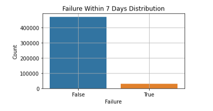
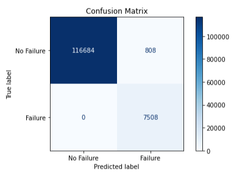
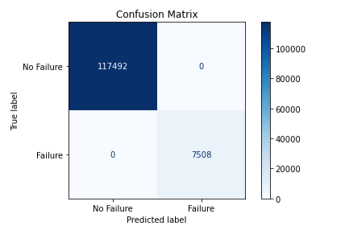

# Predictive Maintenance - Classifying whether a machine will fail within the next 7 days

### Author : Kelvin Kipkorir

## Business Problem
****
Techline Industries is a growing manufacturing company that has numerous machines in its manufacturing plants. As part of its digital transformation strategy, the company is investing in predictive maintenance to reduce operational costs, minimize unplanned downtime, and improve equipment reliability. However, with complex sensor data being generated across various machine types, the company lacks a robust system to anticipate failures before they occur.

To address this challenge, historical sensor data will be used to develop a machine learning model that can predict equipment failures up to one week in advance. This will empower maintenance teams to take timely, corrective actions — helping the company avoid costly downtimes typically associated with traditional maintenance strategies.

## Data Understanding

The dataset used in this project, sourced from Kaggle and titled **"Industrial IoT"**, contains **500,000 entries** representing various operational conditions of industrial machines. It includes **22 columns** capturing both sensor readings and metadata, such as temperature, vibration, pressure, coolant flow, and installation year. These features simulate real-world telemetry data from Industrial IoT systems, providing a good foundation for developing predictive maintenance models.

A visualization of the target feature distribution

## Data Preprocessing

To ensure the dataset was suitable for machine learning models, several preprocessing steps were carried out:

- **Handling Missing Values**: Numerical columns with missing values were imputed using `SimpleImputer`. Additionally, `MissingIndicator` was used to flag the presence of missing values as separate features, preserving any potential signal from missingness patterns.

- **Categorical Encoding**: The `machine_type` feature, which contains 33 unique categories, was transformed using `OneHotEncoder` to allow models to interpret the categorical data numerically.

- **Feature Scaling**: Numerical features were standardized to have zero mean and unit variance using `StandardScaler`, which is especially beneficial for models like Logistic Regression.

- **Class Imbalance Handling**: The target variable was highly imbalanced, with far fewer failure instances. To address this, **SMOTE (Synthetic Minority Over-sampling Technique)** was applied to the training data to generate synthetic samples for the minority class, helping models learn more balanced decision boundaries.

---

##  Model Evaluation
Two machine learning models were trained and evaluated: **Logistic Regression** and **Decision Tree Classifier**.

#### Logistic Regression:

    Accuracy : 0.9935
    Precision: 0.9028
    Recall   : 1.0000
    F1 Score : 0.9489
    

#### Decision Tree:
    Accuracy : 1.0000
    Precision: 1.0000
    Recall   : 1.0000
    F1 Score : 1.0000
    

---

##  Observations

Both models demonstrated strong performance but he decion tree gave a model with higher perfomance achieving an AUC of **~1.0** and near-perfect accuracy and recall, especially for the failure class.

>  **Business Implication**: A high-performing Decision Tree model like this can significantly improve failure detection, especially for rare but critical failure events.

>  **Caveat**: The perfect score may indicate **overfitting** on synthetic or oversampled data. Careful real-world testing and monitoring will be essential post-deployment.

An added advantage of Decision Trees is their **transparency**. Maintenance teams can visualize decision paths, helping understand which sensor readings most influence failure predictions—valuable for diagnostics and gaining operator trust.

Furthermore, some features (e.g., `Laser_Intensity`, `Hydraulic_Pressure_bar`) are **machine-specific** and contain a high proportion of missing values. Building **machine-type-specific models** in future iterations may improve predictive accuracy and interpretability.

#### Recommendations for Deployment

To transition from experimentation to value:
 
   - Select a controlled group of machines with frequent failures.  
   - Integrate the model into existing monitoring systems.  
   - Use real-time sensor feeds to trigger alerts.
---

##  Recommendations for Future Work

- Develop separate models tailored to specific machine types  
- Explore advanced algorithms such as Random Forest or XGBoost for better generalization  
- Consider implementing time-aware cross-validation if temporal features (e.g., timestamps or installation year) are available

